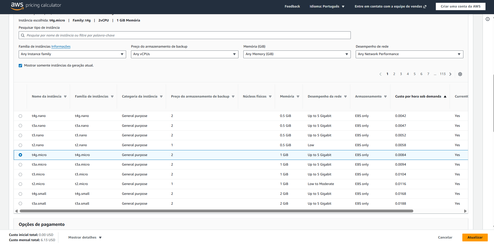
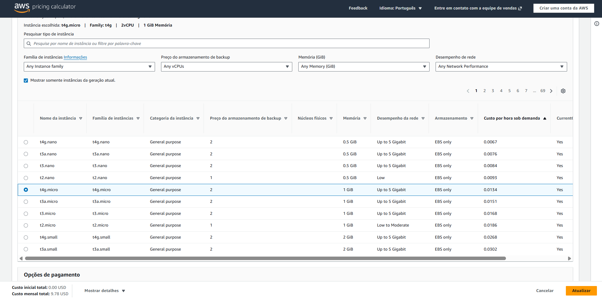
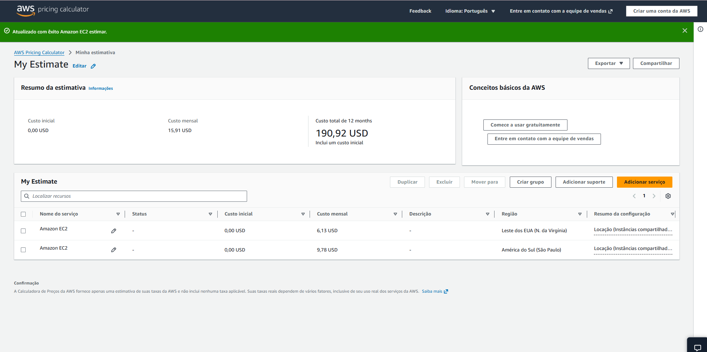
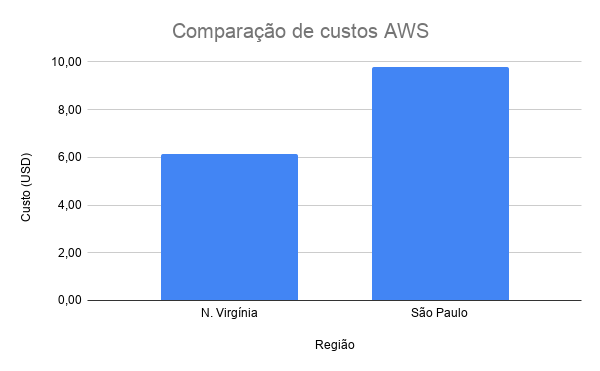

# FIAP - Faculdade de Informática e Administração Paulista

 

# FarmTech na Era da Cloud Computing

## PROJETO FASE 5 – MACHINE LEARNING

## 👨‍🎓 Integrantes

- Henrique Honorio da Silva – RM 567102  
- João Victor Matos de Paiva – RM XXXXX  
- Luiz Frederico Nunes Campêlo – RM XXXXX  
- Manoella Menezes Weiser – RM 567531  
- Mariana Carvalho Youn – RM 568548  

---

## 👩‍🏫 Professores

### Tutor(a)
- Sabrina Otoni

### Coordenador(a)
- André Godoi Chiovato

---

# 📜 Descrição

Este projeto foi desenvolvido como parte da atividade de **Problem Based Learning (PBL)** da FIAP, com foco na aplicação de técnicas de **Machine Learning para análise de dados agrícolas**.

O objetivo do projeto é analisar dados climáticos e ambientais para identificar padrões que influenciam o rendimento das plantações e desenvolver modelos preditivos capazes de estimar o rendimento de uma safra agrícola.

O projeto foi dividido em duas etapas principais:

- **Entrega 1:** análise de dados e desenvolvimento de modelos de Machine Learning para previsão de rendimento agrícola.
- **Entrega 2:** estimativa de custos de infraestrutura em nuvem utilizando a AWS Pricing Calculator para hospedar uma API responsável por executar o modelo desenvolvido.

Para a análise foi utilizado um dataset contendo variáveis como:

- Precipitação  
- Umidade específica  
- Umidade relativa  
- Temperatura  
- Rendimento agrícola (Yield)

---

# 📊 Entrega 1 – Análise de Dados e Modelagem de Machine Learning

O projeto foi estruturado em diferentes etapas típicas de um fluxo de trabalho de **Machine Learning**, incluindo:

### 1. Análise Exploratória de Dados (EDA)

Inicialmente foi realizada uma exploração da base de dados para compreender suas características, estrutura e distribuição das variáveis. Foram utilizados métodos como:

- `df.info()`
- `df.describe()`
- análise de distribuição das variáveis
- visualização gráfica

Essa etapa permitiu entender melhor os dados e identificar possíveis padrões iniciais.

### 2. Clusterização

Foi aplicada uma técnica de **clusterização utilizando o algoritmo K-Means**, com o objetivo de identificar agrupamentos naturais dentro dos dados.

A clusterização permitiu observar possíveis padrões entre variáveis climáticas e o rendimento agrícola, ajudando a entender cenários semelhantes dentro da base de dados.

### 3. Identificação de Outliers

Foi realizada a detecção de **valores discrepantes (outliers)** utilizando gráficos como **boxplots**, permitindo identificar possíveis observações extremas que podem influenciar o desempenho dos modelos preditivos.

A identificação desses valores auxilia na compreensão da variabilidade presente no rendimento agrícola.

### 4. Modelagem Preditiva

Foram desenvolvidos **cinco modelos de regressão supervisionada**, com o objetivo de prever o rendimento agrícola (Yield) com base nas variáveis climáticas disponíveis.

Os modelos implementados foram:

- **Linear Regression**
- **Decision Tree Regressor**
- **Random Forest Regressor**
- **K-Nearest Neighbors (KNN)**
- **Support Vector Regression (SVR)**

Cada modelo foi treinado utilizando os dados de treinamento e posteriormente avaliado com dados de teste.

### 5. Avaliação dos Modelos

Os modelos foram avaliados utilizando métricas comuns em problemas de regressão, como:

- **Mean Squared Error (MSE)**
- **R² Score**

Essas métricas permitiram comparar o desempenho dos diferentes algoritmos e entender qual modelo apresentou melhor capacidade preditiva.

Os resultados indicaram que os modelos apresentaram desempenho limitado, sugerindo que as variáveis disponíveis podem não ser suficientes para explicar completamente a variação do rendimento das safras.

---

## 📁 Estrutura de Pastas

A estrutura do projeto está organizada da seguinte forma:

TRABALHO_FARMTECH
│
├── assets
│   └── logo-fiap.png
│
├── data
│   └── crop_yield.csv
│
├── imagem
│   ├── conf_sp.png
│   ├── conf_virginia.png
│   ├── comparacao.png
│   └── comparacao2.png
│ 
│ 
├── notebook
│   └── MarianaYoun_rm568548_pbl_fase5.ipynb
│
└── README.md

Onde:

- **assets**: contém arquivos visuais utilizados no repositório, como imagens.
- **dataset (.csv)**: base de dados utilizada na análise.
- **imagem**: contém arquivos visuais utilizados no repositório, como imagens.
- **notebook (.ipynb)**: notebook Jupyter contendo toda a análise, modelagem e resultados.

---

## 🔧 Como Executar o Projeto

Para executar o projeto localmente, siga os passos abaixo.

### 1. Pré-requisitos

Certifique-se de possuir instalado:

- Python 3.x
- Jupyter Notebook ou VS Code
- Bibliotecas Python:

pandas
numpy
matplotlib
seaborn
scikit-learn

Para instalar as bibliotecas necessárias:

pip install pandas numpy matplotlib seaborn scikit-learn

### 2. Executar o Notebook

1. Clone o repositório:

git clone https://github.com/seu-usuario/seu-repositorio.git

2. Abra a pasta do projeto.

3. Execute o notebook:

MarianaYoun_rm568548_pbl_fase4.ipynb

4. Execute todas as células do notebook para reproduzir a análise.

---

# ☁️ Entrega 2 – Estimativa de Custos na AWS

Além da análise de Machine Learning apresentada anteriormente, o projeto também inclui uma etapa de planejamento de infraestrutura em nuvem.

Nesta etapa foi realizada uma estimativa de custos utilizando a **AWS Pricing Calculator**, considerando uma máquina virtual responsável por hospedar uma API que receberá dados de sensores agrícolas e executará o modelo de Machine Learning desenvolvido na Entrega 1.

Foram comparadas duas regiões da AWS:

- **América do Sul (São Paulo)**
- **Leste dos EUA (N. Virgínia)**

Essa comparação permitiu avaliar qual região apresenta menor custo e discutir qual seria a melhor escolha considerando fatores técnicos e legais.

### Configuração da Instância

Para realizar a estimativa foi utilizada uma instância **Amazon EC2** com as seguintes características:

- Sistema operacional: **Linux**
- Tipo de instância: **t4g.micro**
- 2 vCPU
- 1 GiB de memória
- Até **5 Gigabit** de desempenho de rede
- **50 GB de armazenamento (EBS)**
- Modelo de cobrança: **On-Demand**

Essa configuração representa um cenário inicial para hospedar uma API responsável por executar o modelo de Machine Learning desenvolvido no projeto.

### Configuração da instância – Região N. Virgínia

Custo estimado mensal: **6.13 USD**

### Configuração da instância – Região São Paulo

Custo estimado mensal: **9.78 USD**

### Comparação das estimativas

---

### Qual a solução mais barata?

A região **Leste dos EUA (N. Virgínia)** apresentou o menor custo mensal estimado, aproximadamente **6.13 USD**, enquanto a região **América do Sul (São Paulo)** apresentou custo aproximado de **9.78 USD por mês**.

### Qual região escolher?

Mesmo sendo mais cara, a região **América do Sul (São Paulo)** pode ser considerada a escolha mais adequada para esse cenário.

Isso ocorre porque podem existir **restrições legais relacionadas ao armazenamento de dados fora do país**, além de que utilizar uma região geograficamente mais próxima dos sensores agrícolas pode reduzir a **latência de comunicação** entre os dispositivos e a API responsável pelo processamento dos dados.

---

# 🎥 Vídeo de Demonstração

Vídeos demonstrando o funcionamento do projeto foi disponibilizado no YouTube como **não listado**.

### Entrega 1 – Machine Learning
Link do vídeo:

### Entrega 2 – Estimativa de Custos AWS
Link do vídeo:

---

# 🗃 Histórico de Lançamentos

* 0.1.0 - Entrega inicial do projeto
    * Implementação da análise exploratória de dados (EDA)
    * Aplicação de clusterização com K-Means
    * Identificação de outliers
    * Desenvolvimento dos modelos de Machine Learning
    * Avaliação comparativa dos modelos

* 0.2.0 - Planejamento de infraestrutura em nuvem
    * Estimativa de custos utilizando AWS Pricing Calculator
    * Simulação de instância EC2 para hospedagem da API
    * Comparação de custos entre as regiões São Paulo e N. Virgínia
    * Análise da melhor região considerando custo, latência e aspectos legais

---

# 📋 Licença

MODELO GIT FIAP por FIAP está licenciado sob
<a href="http://creativecommons.org/licenses/by/4.0/">Attribution 4.0 International</a>.

